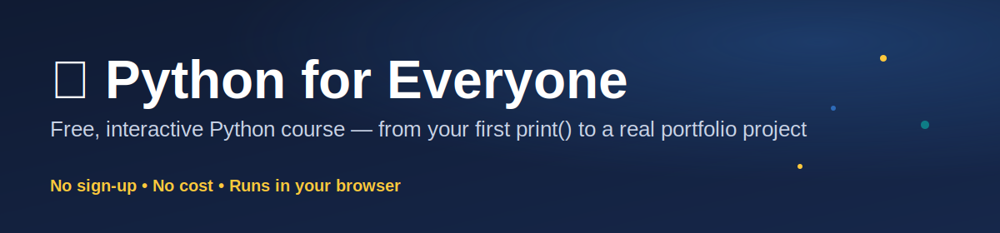

# Python for Everyone



[](LICENSE)
[](docs/curriculum/CURRICULUM_MAP.md)
[](https://technaom.github.io/python-for-everyone/)
[](https://technaom.github.io/python-for-everyone/)

Free, interactive Python course for everyone — from complete beginners to
working professionals. A **hybrid** course by design: it teaches real
Python fundamentals the traditional way (write it yourself, understand
why it works, get it wrong and fix it) and, starting with Chapter 25,
pairs that with genuine AI-collaboration practice — the reasoning behind
each worked example, writing the prompt you'd give an AI assistant to
build it, and an "AI-paired" version of every project with real, subtle
bugs planted in it to practice catching. Neither half substitutes for
the other; see [Chapter 25](chapters/chapter-25-memory-management/lesson.html)
for the current reference implementation.

🔗 **Live course site:** https://technaom.github.io/python-for-everyone/

## Contents

- [What this is](#what-this-is)
- [Status](#status)
- [Repo structure](#repo-structure)
- [Running the Python exercises locally](#running-the-python-exercises-locally)
- [Maintenance](#maintenance)
- [License](#license)

## What this is

A self-paced Python course built as a series of small, interactive HTML
"mini textbooks" — no sign-up, no cost, no assumed background. Every chapter
follows the same format:

1. A real-world hook before any syntax
2. Each sub-topic explained in plain language, with its own "What is...?"
   callouts, annotated code (plus a live in-browser "Run Code" playground
   where the example doesn't need `input()`), an optional "Go Deeper" box,
   and a short Quick Recap
3. **(Chapter 25 onward)** A GenAI thought-process + prompt box after every
   worked example — the reasoning an experienced developer works through
   before writing the code, a space to write your own prompt, and a real
   reference prompt to compare against. There's no scored "AI grader" —
   an earlier heuristic version was retired after it scored the course's
   own reference prompts below perfect; the honest version just points
   you at a real assistant to test your own prompt against.
4. A full Points to Remember summary at the end
5. An interactive fill-in-the-blank quiz — each blank has its own **Check**
   button for instant ✅/❌ feedback, a live progress bar, no backend,
   nothing leaves your browser
6. Exercises, including at least one "Debug the Code" task
7. A Practice Bank — a deeper, per-topic problem set (5-10 problems per
   sub-topic) with at least two scenario-based, interview-style problems
   per topic, for extra reps and interview prep
8. Interview questions (strong answer / red flags / follow-up format) plus
   a rapid-fire recall quiz
9. A small real, resume-worthy project that uses everything the chapter
   taught
10. **(Chapter 25 onward)** An "AI-paired" follow-up to the project — a
    realistic AI-generated solution with 1-3 genuinely subtle bugs planted
    in it, then a reveal walking through what the AI's code actually got
    wrong. The point is practicing code review and skepticism toward AI
    output, not just prompting it.

Every 4-6 chapters form a **module**, capped with a written exam covering
everything in that module. Completing a chapter's quiz with a perfect
score marks it "✓ Completed" sitewide (stored only in your browser's
local storage — no accounts, no tracking).

## Status

This course is being built **one chapter at a time**, piloted and validated
before scaling. 25 of a planned 33 chapters are live, spanning Modules
1-5 (Foundations through Data Analysis with NumPy/Pandas plus Memory
Management). The GenAI thought-process/prompt-box and AI-paired-critique
standard above is new as of Chapter 25 — it's the direction every chapter
from here forward is built with, and a retrofit pass to add it to
Chapters 1-24 is planned but not yet started, so don't expect it on
earlier chapters yet.

See the live [roadmap page](https://technaom.github.io/python-for-everyone/docs/curriculum/index.html)
(or the plain-text draft at
[`docs/curriculum/CURRICULUM_MAP.md`](docs/curriculum/CURRICULUM_MAP.md))
for the full 33-chapter roadmap.

## Repo structure

```text
python-for-everyone/
├── index.html                           → course landing page (GitHub Pages entry point)
├── docs/curriculum/
│   ├── index.html                        → live, styled roadmap page
│   └── CURRICULUM_MAP.md                 → plain-text draft roadmap (repo browsing)
├── assets/
│   ├── style.css                         → shared visual design, used by every page
│   ├── quiz-engine.js                    → shared fill-in-the-blank quiz checking logic
│   └── genai-grader.js                   → wires up the GenAI prompt box's reveal button (Ch25+; no scoring)
├── chapters/
│   └── chapter-25-memory-management/     → current reference implementation of every standard below
│       ├── lesson.html                   → the interactive mini-textbook, incl. GenAI prompt boxes
│       ├── quiz.html                     → fill-in-the-blank quiz
│       ├── interview-questions.html      → Q&A accordion + rapid-fire quiz
│       ├── exercises/                    → index.html, README.md, starter.py, solution.py
│       ├── practice/                     → deeper per-topic problem bank, incl. interview scenarios
│       └── project/
│           ├── index.html                → the solo project, incl. GenAI prompt boxes
│           ├── ai-paired.html            → AI-paired critique loop (solo → AI-paired → find the bugs)
│           ├── README.md, starter.py, solution.py
└── .github/workflows/                    → GitHub Pages deploy workflow
```

Every chapter page is fully cross-linked: lesson → quiz → exercises →
interview questions → project → back to all chapters, plus a top-nav
Roadmap link on every page.

## Running the Python exercises locally

```bash
git clone https://github.com/TechNaom/python-for-everyone.git
cd python-for-everyone
python3 --version   # confirm Python 3 is installed — no other dependencies needed
```

Each chapter's `exercises/` and `project/` folders are plain, dependency-free
Python scripts — just `python3 <file>.py`. The lesson pages and quizzes need
no installation at all; open them directly in a browser or read them via the
live Pages site above.

## Maintenance

This repo is solo-maintained (with AI assistance) and isn't open to external
contributions — issues and PRs from outside contributors aren't reviewed.
See [`CONTRIBUTING.md`](CONTRIBUTING.md) for the maintainer's own workflow
notes.

## License

MIT — see [`LICENSE`](LICENSE). Free to use for your own learning, classroom,
or study group.
